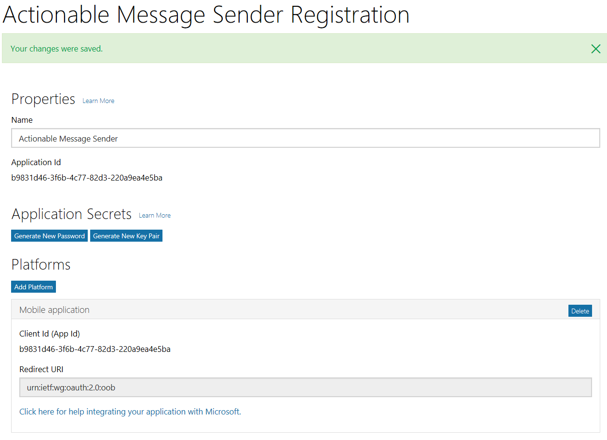
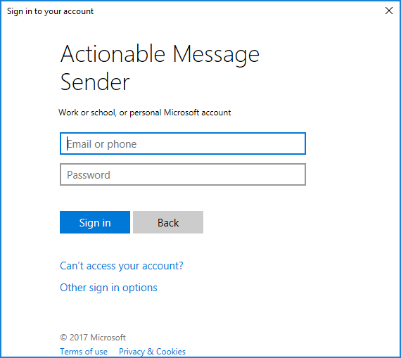

# Send Actionable Message via the Microsoft Graph

A command-line sample that uses [Microsoft Authentication Library](https://www.nuget.org/packages/Microsoft.Identity.Client) and the [Microsoft Graph Client Library](https://www.nuget.org/packages/Microsoft.Graph/) to send a message with an [actionable message card](https://docs.microsoft.com/en-us/outlook/actionable-messages/) to the authenticated user.

## Running the sample

In order to run the sample, you need to register an application in the [Application Registration Portal](https://apps.dev.microsoft.com) to obtain an application ID, then copy that application ID into the [App.config](./App.config) file.

### Register the application

1. Go to the [Application Registration Portal](https://apps.dev.microsoft.com) and sign in with either a Microsoft account or an Office 365 account.
1. Click the **Add an app** button. Enter a name for the application and click **Create application**.
1. Click the **Add Platform** button and choose **Mobile Application**.
1. Click **Save**

> **Note:** As of this writing, there is a bug in the portal that adds a **Web** platform entry to your registration when you click **Save**. If that happens, simply click the **Delete** button on the **Web** platform and click **Save** again.

Once you're done, the registration should look similar to this:



Copy the value of **Application Id**

### Add the application ID to the project

1. Open the [App.config](App.config) file in Solution Explorer.
1. Find the following line: 

    ```xml
    <add key="applicationId" value="" />
    ```
1. Paste the application ID you copied from the portal into the `value` and save the file. For example, using the application ID from the screenshot above, the line would be updated to:

    ```xml
    <add key="applicationId" value="b9831d46-3f6b-4c77-82d3-220a9ea4e5ba" />
    ```

### Build and run the app

Press **F5** in Visual Studio to build and run the app. A command prompt window should appear, and then a pop-up authentication window should appear.



Login with a Microsoft account (with an Outlook.com mailbox) or Office 365 account (with Exchange Online). Review the list of requested permissions and click **Accept** or **Cancel**. (**Note:** choosing **Cancel** will result in the app returning an error and not sending a message.)

The command prompt window should output `Message sent` to indicate success. Check your inbox using Outlook on the web for the message.

### Modifying the message card or body

You can try different formats for the card and message body by modifying [Card.json](Card.json) and [MessageBody.html](MessageBody.html), respectively. To quickly build test card payloads, visit [https://messagecardplayground.azurewebsites.net/](https://messagecardplayground.azurewebsites.net/).